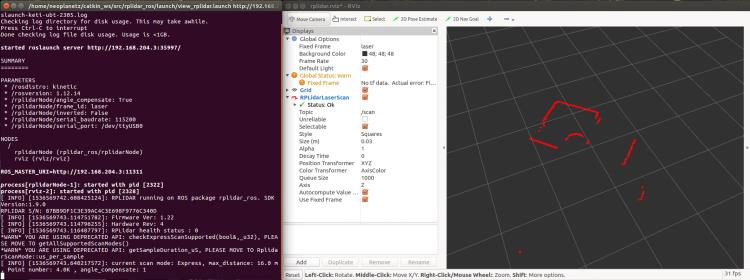

# KETI-ADCM-1B
- 적용 센서
	- 스테레오 카메라: [위드로봇(주) oCamS-1CGN-U](http://www.devicemart.co.kr/1342047)
	- 모노 카메라: [위드로봇(주) oCam-5CRO-U](http://www.devicemart.co.kr/1312029)
	- IMU: [Microinfinity社 CruizCore XG1350](http://www.minfinity.com/page.php?Main=1&sub=1&tab=4)
	- LDS: [SLAMTEC社 RPLIDAR A2 [DFR0445]](http://www.devicemart.co.kr/1312730)
- 개발환경
	- Ubuntu 16.04
	- ROS Kinetic

	
# RP Lidar ROS 설치 및 사용하기

1. RP Lidar 패키지를 다운 및 빌드하기 [Link](https://github.com/robopeak/rplidar_ros)
```
$ cd ~/catkin_ws/src
$ git clone https://github.com/robopeak/rplidar_ros
$ cd ~/catkin_ws
$ catkin_make
```

2. RP Lidar를 사용하기위해 usb 장치에 권한 부여하기 및 재부팅하기
```
$ cd ~/catkin_ws/src/rplidar_ros/
$ sudo ./scripts/create_udev_rules.sh
$ reboot
```

3-1. RP Lidar ROS 실행하기 (RP Lidar ROS 토픽만 실행할 경우)
```
$ roscore
$ roslaunch rplidar_ros rplidar.launch
```

3-2. RP Lidar ROS 실행하기 (RP Lidar ROS 토픽과 Rviz를 이용한 View 실행할 경우)
```
$ roscore
$ roslaunch rplidar_ros view_rplidar.launch
```




# WithRobot Stereo Camera 설치 및 사용


1. 위드로봇 스테레오 카메라 사용을 위한 패키지들 설치
```
$ sudo apt-get install libv4l-dev libudev-dev ros-kinetic-rtabmap*
```

2. 깃허브에서 oCam Stereo Camera 패키지를 다운로드
```
$ cd ~/catkin_ws/src/
$ svn export https://github.com/withrobot/oCamS/trunk/Software/oCamS_ROS_Package/ocams
```

3. Catkin을 이용하여 다운받은 ocams 를 빌드하기
```
$ cd ~/catkin_ws/
$ catkin_make
$ source devel/setup.bash
```

4. IMU 데이터 획득을 위해 가상 Comport 설정
```
$ sudo gedit /etc/udev/rules.d/99-ttyacms.rules

ATTRS{idVendor}=="04b4" ATTRS{idProduct}=="00f9", MODE="0666",
ENV{ID_MM_DEVICE_IGNORE}="1"
ATTRS{idVendor}=="04b4" ATTRS{idProduct}=="00f8", MODE="0666",
ENV{ID_MM_DEVICE_IGNORE}="1"

$ sudo udevadm control --reload-rules
```

5. ocams_ros 런치파일 실행
```
$ roslaunch ocams ocams_ros.launch
```


# WithRobot USB Camera 설치 및 사용

1. USB 카메라를 USB 포트에 연결하고 접속되었는지 확인
```
$ lsusb
```

2. uvc camera 패키지설치
```
$ sudo apt-get install ros-kinetic-uvc-camera
```

3. Image 관련패키지설치
```
$ sudo apt-get install ros-kinetic-image-*
$ sudo apt-get install ros-kinetic-rqt-image-view
```

4. uvc_camera 노드실행
```
$ roscore
$ rosrun uvc_camera uvc_camera_node
```

5. 토픽 메시지 확인(/image_raw 토픽이 있는지 확인)
```
$ rostopic list
```

6. 카메라이미지정보확인(image_view 나rqt_image_view를사용)
```
$ rqt_image_view image:=/image_raw
```


7. 카메라 캘리브레이션 진행요망 확인


# Microinfinity IMU 설치 및 사용
- 제조사 제공 ROS package가 없기 때문에, 직접 ROS용 패키지 개발완료


# Acknowledgment
- 본 Git은 연구 결과물은 철저하게 배제되어 있음
- 센서 인터페이스를 참여기관 간 공유하기 위해 관련 자료만 commit함
- 과제 관련 정보는 3차년도 시작 시 공개 예정임
